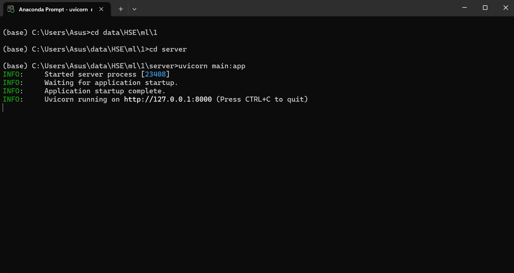
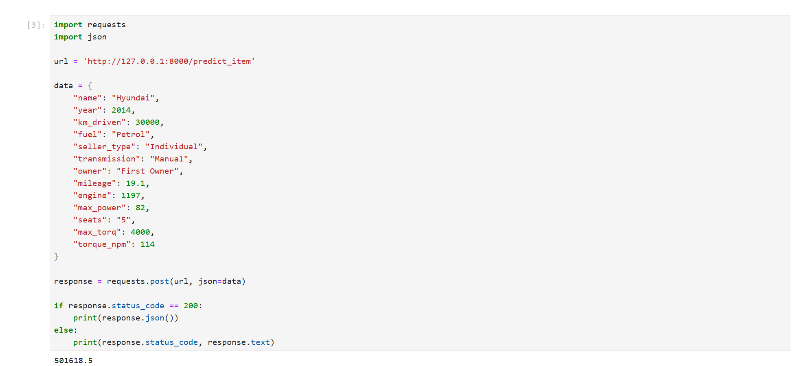
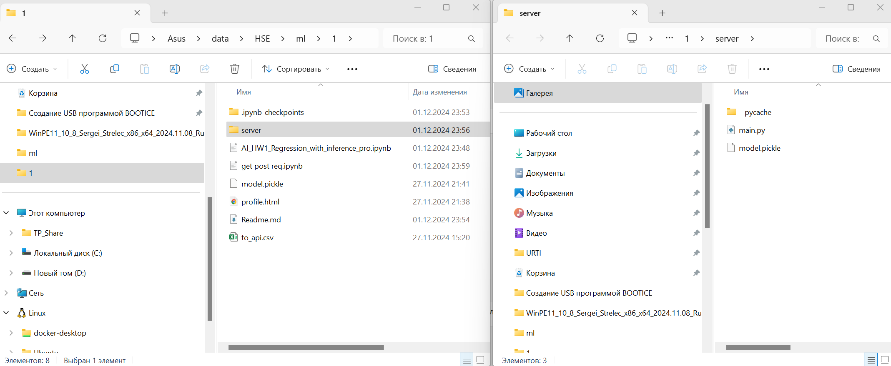
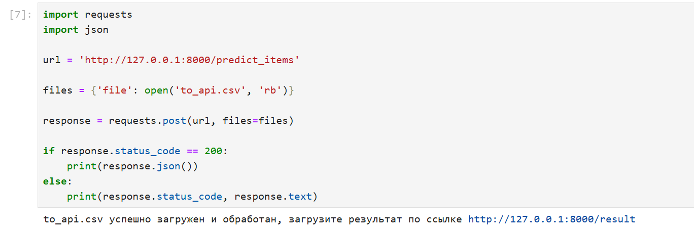
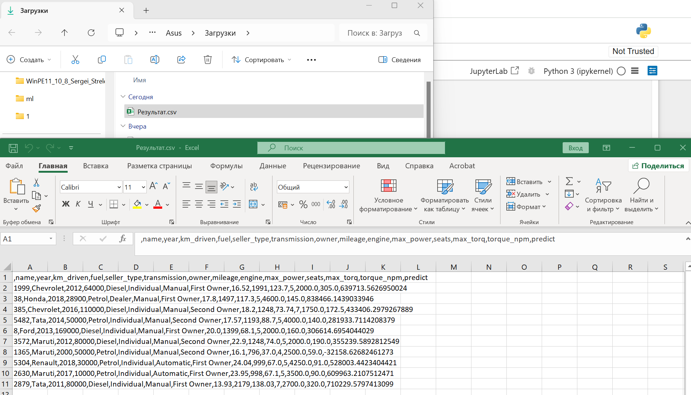
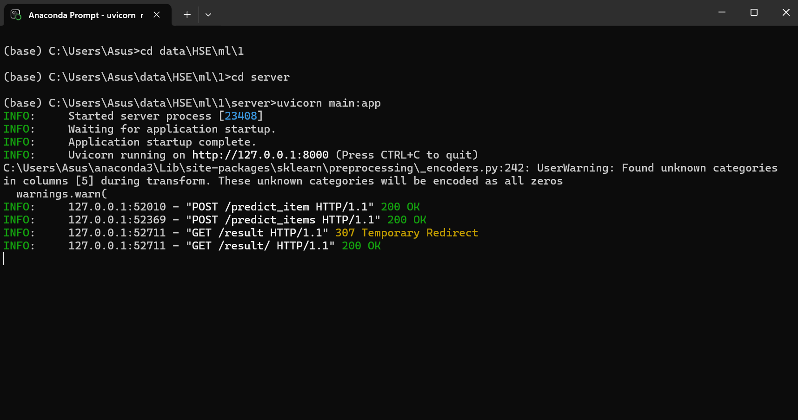

1. Этап сбора и обработки данных
    - проверили наличие пропусков и дубликатов в данных.
    - проанализировали основные статистики датасета и построили дашборд.
    - обработали и привели признаки mileage, engine, max_power и torque к числовому виду, для работы модели.
    - заполнили пропуски средними значениями.

2. Визаулизация
    - построили два pairplota для тестовых и тренировочных данных
    - построили кореляционные матрицы пирсона, спирмана и phik матрицу. А также реализовали свою функцию корреляции спирмана.
    - построили боксплоты для понимания выбросов.

3. Моделирование
    - обучили модель только на вещественных признаках, получили r2_score = 0.6
    - реализовали несколько метрик самостоятельно таких как r2 и r2_adj
    - провели стандартизацию признаков с помощью standartscaler
    - создали и обучили несколько моделей с регуляризацией l1, elasticnet и провели подбор их гиперпараметров через gridsearch. По метрике r2_score, результат не сильно отличается от нашей первой модели.
    - добавили категориальные фичи к нашим данным и провели OHE.
    - создали пайплайн обучения для использование OHE и SS на весь набор данных без дублирования кода. Использовали Gridsearch и Ridge регрессию. Получили лучший результат из всех моделей r2 = 0.78 на тестовых данных.
    - сохранили результаты моделирования в pickle файл.
    - провели оценку бизнес метрики по Доле прогнозов где цены не отличаются от реальной не более чем на 10 % и в нашей лучшей модели получили результат 31%.
    - наибольший буст к качеству получили за счет добавления новых признаков, а именно категориальных фичей.
    - попробовали поработать с преобразованием признаков, но такое исследование не принесло прироста по метрикам.
4. Из того что не получилось:
    - не получилось создать l0 регуляризацию, из-за недостатка времени
    - а также некоторые пункты из Feature Engineering, попробовал только год в квадрате, опять же из за времени, сам не расчитал подход

5. Реализация сервиса на FastAPI
    - подготовили данные для отправки на сервис, такие как словарь json и csv файл.
    - сделали два пост запроса по отправке одной записи и csv файла.
    - а также сделали гет запрос для загрузки нового файла с предиктами.

6. Пример работы сервиса

